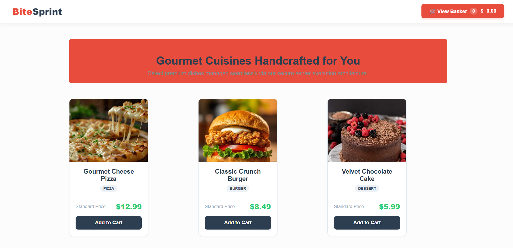
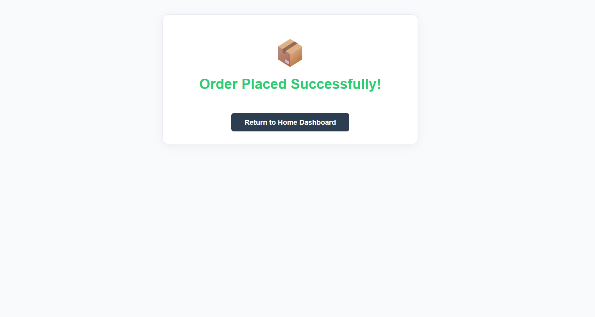

#  Food Ordering System

A web-based Food Ordering System developed using Spring Boot, Java, HTML, CSS, Thymeleaf, and H2 Database.

## 📌 Project Description

This project is a simple food ordering web application where users can browse available food items, add items to their cart, and place orders.

The application provides a user-friendly interface for viewing food items and managing the shopping cart.

## ✨ Features

- View available food items
- Food categories such as pizza, burger, and dessert
- Add food items to cart
- View shopping cart
- Calculate order total
- Place an order
- Order success page
- Simple admin page
- Responsive web interface

## 🛠️ Technologies Used

- Java
- Spring Boot
- Spring MVC
- Thymeleaf
- HTML5
- CSS3
- Maven
- H2 Database

## 📂 Project Structure

```text
foodorder
│
├── pom.xml
├── .gitignore
├── README.md
│
└── src
    └── main
        ├── java
        │   └── com.example.foodorder
        │       ├── FoodorderApplication.java
        │       ├── controller
        │       └── model
        │
        └── resources
            ├── static
            │   ├── css
            │   └── images
            │
            └── templates
                ├── index.html
                ├── cart.html
                ├── success.html
                ├── order-success.html
                └── admin.html
```          

## 📸 Screenshots

 ### 🏠 Home Page

<p align="center">
  
</p>

---

## 🛒 Shopping Cart

<p align="center">
  
</p>

---

##  ✅ Order Confirmation

<p align="center">
  
</p>

## ⚙️ How to Run the Project

### Prerequisites

Make sure the following are installed on your computer:

- **Java JDK 21**
- **Visual Studio Code**
- **Java Extension Pack for Visual Studio Code**
- **Git**

---

### Step 1: Clone the Repository

Open a terminal and run:

```bash
git clone https://github.com/shanmukhapriyadasugari/food-ordering-system.git

Step 2: Open the Project in Visual Studio Code

Open the cloned food-ordering-system folder in Visual Studio Code.

Step 3: Open the Main Application

Navigate to:
src/main/java/com/example/foodorder/FoodorderApplication.java

Step 4: Run the Application
Open FoodorderApplication.java in Visual Studio Code.
Click the Run button to start the Spring Boot application.
Wait until the application starts successfully.

Step 5: Open the Application in Browser
Open a web browser and visit:
http://localhost:8080
The Food Ordering System will now be available in the browser.
```

## 🔄 Application Flow

User
  ↓
Browse Food Menu
  ↓
Select Food Item
  ↓
Add Item to Cart
  ↓
Review Cart
  ↓
Place Order
  ↓
Order Confirmation

## 🎯 Project Objective
The main objective of this project is to develop a web-based food ordering application while gaining practical experience in backend development, frontend development, database integration, and Spring Boot application development.  

## 🚀 Future Improvements
The following features can be added in future versions:
User registration and login
User authentication and authorization
Order history
Online payment integration
Improved admin dashboard
Production database integration
Cloud deployment
Food search and filtering
User reviews and ratings
Improved mobile responsiveness


## 👩‍💻 Developed By:
Shanmukha Priya Dasugari
